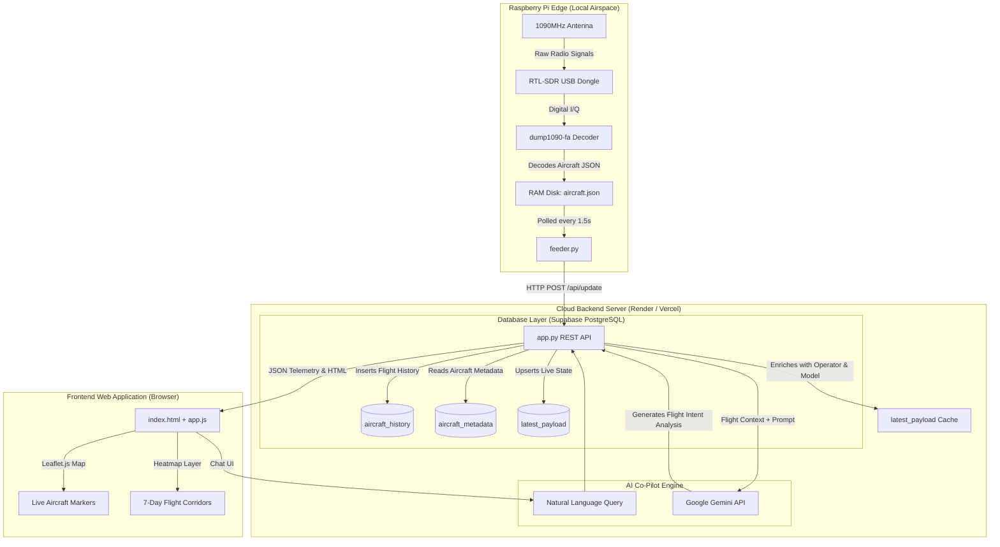

# SkySync ADS-B Flight Tracker & AI Airspace Co-Pilot
## Comprehensive Architecture, Data Flow, and Directory Reference

---

## 1. Overview & Vision
**SkySync** is an advanced real-time ADS-B flight tracker and AI-powered airspace intelligence engine created for the **Congressional App Contest**.

### Problem & Solution Statement
> *"Air traffic affects almost everyone, but most flight trackers just show planes and where they are going. This tracker helps people understand the **WHY** in air traffic—using live weather radar, wind vectors, 7-day historical database analytics, and an integrated AI Airspace Co-Pilot."*

---

## 2. Directory Structure & File Inventory

```
concorde/
├── ARCHITECTURE.md                  # Comprehensive technical architecture & documentation
├── LICENSE                          # Project license
├── pi_feeder/                       # Raspberry Pi Edge Feeder Component
│   ├── concorde-feeder.service      # Systemd service definition for 24/7 background feeder execution
│   ├── feeder.py                    # Lightweight Python script running on Pi to read dump1090 RAM disk JSON
│   ├── requirements.txt             # Dependency list (requests)
│   └── setup_pi.sh                  # Automated shell script to install dependencies and systemd unit on Pi
└── tracker/                         # Web Application & Cloud Backend Server
    ├── app.py                       # Main Flask web application, REST API routes, DB layer & AI intent engine
    ├── aircraftDatabase.csv         # OpenSky Network aircraft metadata database (~94 MB, ICAO24 mappings)
    ├── aircraft_history.db          # Local SQLite development database (auto-created if Postgres not configured)
    ├── requirements.txt             # Backend dependencies (flask, psycopg2, requests)
    ├── vercel.json                  # Vercel serverless deployment routing configuration
    ├── static/                      # Frontend Assets & Client Logic
    │   ├── app.js                   # Primary Leaflet map engine, polling loop, search & AI Co-Pilot UI
    │   └── style.css                # Custom glassmorphic CSS styling, responsive desktop/mobile rules
    └── templates/                   # Server-side HTML Templates
        └── index.html               # Main single-page web app container markup
```

---

## 3. System Architecture & Components



---

## 4. End-to-End Flow of Data

### Phase 1: Signal Capture & Edge Processing (Raspberry Pi)
1. **Radio Signal**: ADS-B transponders on aircraft broadcast 1090 MHz radio pulses containing position, velocity, squawk code, altitude, and callsign.
2. **SDR & Decoder**: An antenna connected to an RTL-SDR USB dongle on the Raspberry Pi captures raw signals. `dump1090-fa` decodes the signals and writes live data to `/run/dump1090-fa/aircraft.json` on a local RAM disk to prevent SD card wear.
3. **Edge Feeder (`pi_feeder/feeder.py`)**: A lightweight background service polls `aircraft.json` every 1.5 seconds, formats the payload, and sends an authenticated HTTP POST request to `/api/update` on the Cloud Backend with an `Authorization: Bearer <secret>` header.

### Phase 2: Ingestion & Telemetry Processing (Cloud Backend)
1. **Authentication**: `tracker/app.py` receives `/api/update` and validates the Bearer token against `FEEDER_SECRET`.
2. **State & Metadata Enrichment**:
   - Looks up plane `hex` code in the OpenSky Network metadata table (`aircraft_metadata`) to inject aircraft model and operator/airline names.
   - Calculates **Wind Crab Angle Drift** (`track_diff = |track - heading|`).
   - Identifies military squawks (`7500`, `7600`, `7700`) and military callsign prefixes (`RCH`, `PAT`, `FORTE`, `VIPER`, etc.).
3. **Dual Persistence**:
   - Updates the stateless `latest_payload` table for fast serverless responses.
   - Appends telemetry rows to `aircraft_history` for 7-day historical heatmap generation, analytics calculations, and search features.

### Phase 3: Client Visualization & Interactivity (Frontend)
1. **Map Polling (1.0s)**: `static/app.js` polls `/data` to retrieve active planes, smoothly updating marker positions, rotations (track angle), and color coding (red/orange for low altitude, purple for high altitude).
2. **Weather & Atmospheric Wind Overlay**:
   - Fetches NEXRAD Doppler radar tiles directly from RainViewer API.
   - Queries Open-Meteo grid endpoints to render live animated wind streamlines on a HTML5 `<canvas>` map overlay.
3. **7-Day Heatmap Streamlines**:
   - Requests `/api/history` to load historical coordinates, feeding `Leaflet.heat` to render high-density flight corridors and terminal arrival clusters.

### Phase 4: AI Airspace Co-Pilot Engine (`tracker/app.py` -> `/api/ai/query`)
1. **Google Gemini LLM Integration**:
   - The backend natively integrates with the `google-genai` SDK to route natural language flight questions to the `gemini-3.6-flash` model.
2. **Context-Aware Prompt Injection**:
   - When a user asks about a specific aircraft, the backend automatically intercepts the query, pulls the aircraft's live telemetry (altitude, ground speed, track, heading, aircraft model) from the database, and injects it into Gemini's system prompt.
   - This allows Gemini to accurately explain complex aviation concepts like "wind drift crab angles" and "terminal maneuvering" without hallucinating.
3. **Structured SQL Rank Queries**:
   - For structured database questions (e.g., "What are the top 10 airlines?", "Fastest planes recorded"), the backend continues to use highly optimized SQL queries to return HTML data tables instantly.

---

## 5. Key API Endpoint Reference

| Endpoint | Method | Description |
|---|---|---|
| `/` | `GET` | Renders the main flight tracking web interface (`templates/index.html`). |
| `/api/update` | `POST` | Authenticated ingestion endpoint for the Raspberry Pi feeder payload. |
| `/data` | `GET` | Returns live active aircraft telemetry for client map polling. |
| `/api/search` | `GET` | Searches `aircraft_history` DB by callsign or hex code. |
| `/api/analytics/dashboard` | `GET` | Aggregates KPIs (lowest flight, fastest speed, busiest hour, avg crosswind drift, top models, top airlines, military flights). |
| `/api/ai/query` | `POST` | Primary AI Co-Pilot endpoint for natural language questions and flight intent explanations. |
| `/api/history` | `GET` | Returns 7-day track points for heatmap layer visualization. |
| `/api/route` | `GET` | Fetches flight route details (origin/destination) via AviationStack API. |

---

## 6. Database Schema Overview

### `aircraft_history` Table
- `id`: Primary key (Serial / Autoincrement)
- `hex`: 6-character ICAO transponder address
- `callsign`: Flight identifier (e.g. `DAL123`)
- `lat` / `lon`: Geographical coordinates
- `altitude`: Altitude in feet MSL
- `heading`: Magnetic nose heading (degrees)
- `track`: Ground track angle (degrees)
- `speed`: Ground speed (knots)
- `track_diff`: Calculated wind crab angle ($|\text{track} - \text{heading}|$)
- `operator`: Airline or aircraft operator name
- `model`: Aircraft model type (e.g. `Boeing 737-800`)
- `is_military`: Flag (1 = Military / Special operation, 0 = Commercial / GA)
- `timestamp`: UTC observation timestamp

### Database Performance Indexes (`ensure_db_indexes`)
- `idx_timestamp`: `CREATE INDEX idx_timestamp ON aircraft_history(timestamp DESC)` (Rapid date-window scans)
- `idx_altitude`: `CREATE INDEX idx_altitude ON aircraft_history(altitude)` (Instant lowest flight queries)
- `idx_speed`: `CREATE INDEX idx_speed ON aircraft_history(speed DESC)` (Instant fastest speed queries)
- `idx_is_military`: `CREATE INDEX idx_is_military ON aircraft_history(is_military, timestamp DESC)` (Fast military flight scans)
- `idx_operator` / `idx_model`: Indexed grouping for top airlines and aircraft model rankings.
- `idx_hex` / `idx_callsign`: High-speed flight search & history lookup index.

---

## 7. Operational & Deployment Guide

1. **Local Development**:
   - Run backend: `python3 tracker/app.py` (starts server at `http://127.0.0.1:8081`).
   - Run mock feeder: `python3 tracker/mock_feeder.py` (simulates live aircraft telemetry).
2. **Raspberry Pi Production Feeder**:
   - Run setup script: `sudo bash pi_feeder/setup_pi.sh`
   - Configures systemd unit `concorde-feeder.service` to push Pi telemetry automatically on boot.
3. **Vercel Cloud Production**:
   - Deploys Flask application automatically via `tracker/vercel.json` with PostgreSQL database bindings (`DATABASE_URL`).
